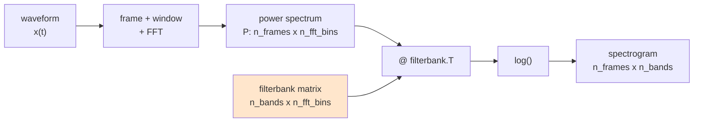
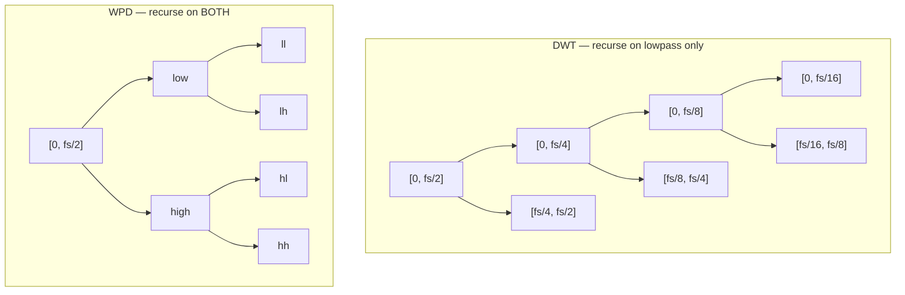
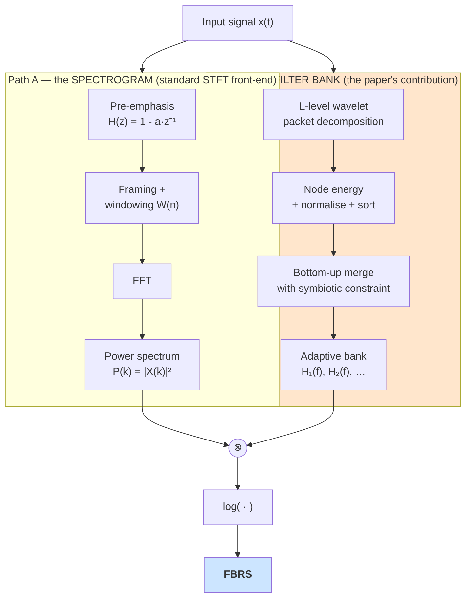
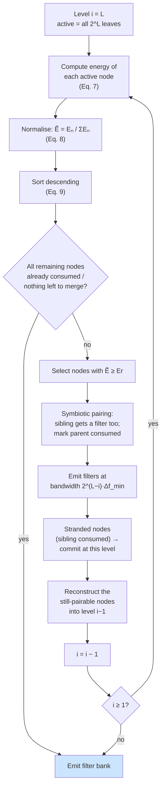
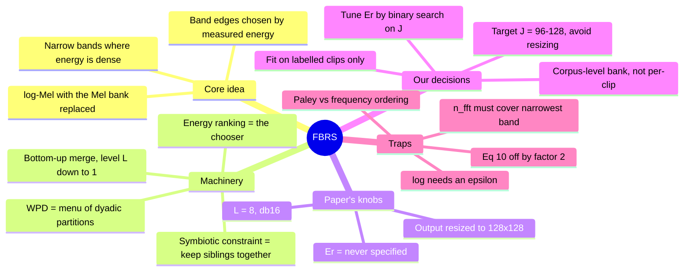

# FBRS Explained — Frequency Band Recalibrated Spectrogram

> Deep-dive on **Contribution 1** of *"Towards accurate bird sound recognition through
> multi-scale texture-aware modeling"* (Qin & Huang, npj Acoustics 2025), written for a
> software engineer who wants to **implement** it, not just cite it.
>
> **Sources used:** paper §"More interpretive time-frequency analysis", Eqs. (5)–(12),
> **Fig. 11** (computational flow) and **Fig. 12** (pseudo-code). Fig. 11 and Fig. 12
> contain mechanics that the prose omits — most of this document's precision comes from them.

---

## How to read this document

Every major idea is explained at **four increasing levels of depth**. Read across, stop
when you're satisfied, come back for the next layer when you need it.

| Level | Label | What it gives you |
|---|---|---|
| **L0** | *In one line* | The claim, no machinery |
| **L1** | *Software-engineer analogy* | Data structures, types, shapes — the mental model |
| **L2** | *Signal-processing detail* | What is actually happening to the audio |
| **L3** | *The math* | The paper's equations, term by term |

Sections **1–7** describe FBRS **exactly as the paper defines it**.
Section **8** onward covers **our AnuraSet adaptation** and is clearly marked.
Nothing from our project leaks into §1–7.

---

## Table of contents

**Part I — the paper**
1. [The one-paragraph version](#1-the-one-paragraph-version)
2. [The prerequisite idea: every spectrogram is a filter bank](#2-the-prerequisite-idea-every-spectrogram-is-a-filter-bank)
3. [Wavelet packet decomposition, from zero](#3-wavelet-packet-decomposition-from-zero)
4. [The FBRS algorithm](#4-the-fbrs-algorithm)
5. [Worked trace of Fig. 11](#5-worked-trace-of-fig-11)
6. [The math, equation by equation](#6-the-math-equation-by-equation)
7. [Why the paper claims this beats STFT / CQT / Mel](#7-why-the-paper-claims-this-beats-stft--cqt--mel)

**Part II — implementing it**

8. [Ambiguities and errors in the paper](#8-ambiguities-and-errors-in-the-paper)
9. [Design decisions we have to make](#9-design-decisions-we-have-to-make)
10. [Datos del proyecto (22.05 kHz, 3 s, 40 especies observadas)](#10-datos-del-proyecto-2205-khz-3-s-40-especies-observadas)
11. [Implementation sketch](#11-implementation-sketch)
12. [How to verify your implementation](#12-how-to-verify-your-implementation)
13. [Summary cheat-sheet](#13-summary-cheat-sheet)

---
---

# Part I — the paper

## 1. The one-paragraph version

**L0 — In one line.**
FBRS is a **log-Mel spectrogram with the Mel filter bank replaced by a filter bank whose
band edges are derived from where the signal's energy actually is.**

That is the whole idea. Everything else is the machinery for *choosing the band edges*.

**L1 — Software-engineer analogy.**
Think of a log-Mel spectrogram as this function:

```
power_spectrum : [n_frames, n_fft_bins]      # from STFT
filterbank     : [n_bands,  n_fft_bins]      # a CONSTANT matrix
spectrogram    = log(power_spectrum @ filterbank.T)   # [n_frames, n_bands]
```

In Mel, `filterbank` is a **constant** computed from a formula (`mel(f) = 2595·log10(1+f/700)`).
It does not look at your audio. It is the same matrix for a whale song, a car horn, or silence.

FBRS keeps the *exact same last line*. It only changes how `filterbank` is built: instead of
a formula, it **runs a procedure over your signal** that measures energy per frequency band and
returns a matrix with **narrow rows where energy is dense** and **wide rows where it isn't**.

```python
# Mel
filterbank = mel_filters(sr, n_fft, n_mels)              # signal-independent

# FBRS
filterbank = fbrs_filters(signal, sr, n_fft, L, Er)      # signal-DEPENDENT
```

**L2 — Signal-processing detail.**
Bird energy is concentrated in 0–8 kHz with a peak at 3–5 kHz and is negligible above 10 kHz
(the paper measures this in Fig. 1). A Mel bank spends bands there too, but by a *fixed
perceptual curve tuned to human hearing*, not to bird acoustics. FBRS instead runs a
**wavelet packet decomposition** (a binary tree of band-splits), measures the energy sitting in
each leaf band, and then **merges low-energy sibling bands back together** while **keeping
high-energy bands at full resolution**. The result is a non-uniform partition of
`[0, Nyquist]` where bandwidth is inversely related to measured energy.

**L3 — The math.**
Final output is Eq. (12):

$$\mathrm{FBRS} = \log\big(ER(j)\big) = \log\Big(\sum_k P(k)\,H_j(k)\Big)$$

`P(k)` = power spectrum of the (pre-emphasised, windowed) frame. `H_j(k)` = the *j*-th filter
of the adaptive bank. §4 and §6 explain how `{H_j}` is constructed.

---

## 2. The prerequisite idea: every spectrogram is a filter bank

This section is the single most useful reframing for implementing FBRS. If you internalise it,
FBRS stops being exotic.

**L0 — In one line.**
STFT, Mel, CQT, and FBRS are the *same computation* with four different filter-bank matrices.

**L1 — Software-engineer analogy.**
All four follow this pipeline:



Only the orange box differs:

| Representation | How `filterbank` is built | Bands | Adaptive? |
|---|---|---|---|
| **STFT** | identity — one filter per FFT bin | uniform, `fs/n_fft` wide | no |
| **Mel** | triangles uniformly spaced on the mel scale | narrow low-f, wide high-f | no |
| **CQT** | geometric spacing, constant `Q = f_c / BW` | log-spaced | no |
| **FBRS** | **energy-guided wavelet packet merge** | dyadic widths `2^i · Δf_min` | **yes** |

**L2 — Signal-processing detail.**
A row of `filterbank` is a **weighting profile over frequency**. Multiplying the power spectrum
by it and summing = "how much of the signal's energy falls in this band, weighted by this shape."
Mel rows are triangles; FBRS rows are (per Fig. 11) also drawn as triangles, but their
**support** — the frequency interval they are non-zero on — comes from wavelet packet node
boundaries rather than a formula.

The three "knobs" a filter bank has are:

1. **Where** each band sits (centre frequency)
2. **How wide** each band is (bandwidth / resolution)
3. **What shape** the weighting has (triangle, rectangle, Gaussian)

Mel fixes all three by formula. **FBRS lets the signal choose #1 and #2.**

**L3 — The math.**
Eq. (11):

$$ER(j) = \sum_k P(k)\,H(k), \qquad j = 0,1,\dots,J$$

This is literally a matrix–vector product per frame. `J` is the number of adaptive bands.
Note `J` is **not** a fixed hyperparameter — it is an *output* of the algorithm. That has
consequences; see §8.3.

---

## 3. Wavelet packet decomposition, from zero

You need WPD only to understand **how the candidate band edges are generated**. It is a binary
tree, and the tree is a **heap** — which makes the implementation pleasant.

### 3.1 One split

**L0 — In one line.**
Take a signal, produce two half-bandwidth signals: the low half and the high half.

**L1 — Software-engineer analogy.**

```python
def split(x, h, g):
    lo = downsample2(convolve(x, h))   # lowpass  -> lower half of the band
    hi = downsample2(convolve(x, g))   # highpass -> upper half of the band
    return lo, hi                       # each has len(x)/2 samples
```

`h` and `g` are a **quadrature mirror filter pair** — a complementary lowpass/highpass duo
designed so the split is **invertible** (perfect reconstruction) and **energy-preserving**
(orthogonal). For `db16`, `h` has 32 taps.

Total sample count is preserved: `len(lo) + len(hi) == len(x)`. You have traded *time*
resolution for *frequency* resolution — each output has half the samples but covers half
the bandwidth.

**L2 — Signal-processing detail.**
If `x` covers `[0, fs/2]`, then after one split `lo` covers `[0, fs/4]` and `hi` covers
`[fs/4, fs/2]`. Downsampling by 2 is what makes this recursive: `lo` now looks like a signal
at sample rate `fs/2`, so you can apply exactly the same `split` to it again.

**L3 — The math.**
Paper Eq. (6) — the **two-scale relations** that generate the whole wavelet packet family
from a single filter `h`:

$$
\begin{cases}
w_{2n}(t) = \sqrt{2}\sum_k h_k\, w_n(2t-k) \\[4pt]
w_{2n+1}(t) = \sqrt{2}\sum_k (-1)^k h_{1-k}\, w_n(2t-k)
\end{cases}
$$

with `w₀ = φ(t)` the **scaling function** (lowpass generator) and `w₁ = ψ(t)` the **wavelet
function** (highpass generator). Read it as: *index `n` doubles at every level; even index =
apply lowpass, odd index = apply highpass.* The term `(-1)^k h_{1-k}` is the standard recipe
for producing the highpass `g` from the lowpass `h`.

### 3.2 DWT vs WPD — the key distinction

**L0 — In one line.**
DWT recurses **only into the low half**; WPD recurses into **both halves**.

**L1 — Software-engineer analogy.**



DWT gives you **octave bands** — logarithmic, fine at low frequency, coarse at high. That's a
fixed choice, just like Mel is a fixed choice.

WPD at level `L` gives you **`2^L` leaves of equal bandwidth** — a *uniform* fine grid.
Crucially, WPD's tree contains **every dyadic band partition as a sub-tree**, including the
DWT one. That is exactly why the paper uses WPD: it is the **search space** of possible band
layouts, and the energy rule picks a member of it.

> **This is the conceptual pivot of FBRS:** the wavelet packet tree is not the output. It is
> the *menu of possible frequency partitions*, and the energy ranking is the *chooser*.

**L2 — Signal-processing detail.**
Two properties you rely on:

- **Orthogonality / Parseval.** Total energy is conserved across a level:
  `Σ energy(children) == energy(parent)` (up to boundary effects). This is what makes
  "compare energy across bands" meaningful.
- **Perfect reconstruction.** A parent can be exactly rebuilt from its two children.
  This is what the **symbiotic constraint** (§4.2) protects.

**L3 — Node indexing.** The paper's Fig. 11 numbers nodes **breadth-first, 1-indexed** —
i.e. a **binary heap**:

```
                  1                     level 0  (root, full band)
          2               3             level 1
      4       5       6       7         level 2
    8   9  10  11  12  13  14  15       level 3  (leaves, 2^3 = 8 bands)
```

So the arithmetic is trivial:

```python
parent(n)   = n // 2
sibling(n)  = n ^ 1        # XOR flips the last bit: 10 <-> 11, 4 <-> 5
children(n) = (2*n, 2*n+1)
level(n)    = n.bit_length() - 1
```

Verify against the figure: node 10's sibling is `10 ^ 1 = 11` ✅ (the paper's own example),
node 4's sibling is `5` ✅, node 2's children are `4, 5` ✅.

### 3.3 The frequency-ordering trap ⚠️

**This will bite you.** The natural (Paley) ordering of WPD leaves is **not** frequency-ordered.

**Why:** downsampling a highpass band **mirrors** its spectrum. So inside a `high` branch, the
sub-branch labelled `low` actually sits at *higher* frequency than the one labelled `high`.
At level 3 the natural order `[8,9,10,11,12,13,14,15]` maps to frequency-ordered bands as
`[8,9,11,10,14,15,13,12]` (Gray-code / *sequency* order).

**What to do:** in PyWavelets, always ask for frequency ordering explicitly:

```python
nodes = wp.get_level(L, order='freq')   # NOT order='natural' (the default)
```

If you skip this, your filter bank's band edges will be scrambled, the spectrogram's vertical
axis will be meaningless, and — worst of all — **it will still train and produce plausible
accuracy**, so the bug is silent. Test for it (§12).

### 3.4 Why `db16`?

**L2.** `db16` = Daubechies wavelet with 16 vanishing moments → **32 filter taps**.
Longer filter ⇒ **sharper transition band** ⇒ less spectral leakage between adjacent nodes ⇒
the per-node energies are a cleaner estimate of "energy in this band."

The cost is **longer time support**. The effective impulse response at level `L` is roughly
`(32-1)·(2^L - 1) + 1` samples. At `L = 8` that's ≈ 7900 samples ≈ 247 ms at 32 kHz — a
sizeable fraction of a 5 s clip, so boundary effects are real but tolerable. The paper does
not discuss this.

---

## 4. The FBRS algorithm

### 4.1 The two independent halves

Fig. 11's top row shows something the prose does not make obvious: **the input signal goes down
two independent paths that only meet at the end.**



**Path A is not novel** — it is the exact front-end of MFCC/log-Mel: pre-emphasis, Hamming
window, FFT, magnitude squared. **Path B is the entire contribution.**

Note also: per the pseudo-code, Path A operates on the **pre-emphasised** signal `PX(t)`, while
Path B (line 4) decomposes the **raw** `X(t)`. Minor, but worth matching if you want fidelity.

### 4.2 The symbiotic constraint

**L0 — In one line.**
You can never keep one child of a node without also keeping its sibling.

**L1 — Software-engineer analogy.**
Think of the wavelet packet tree as a **B-tree page split you may or may not commit**. A parent
band is stored as two children. If you decide to keep the pair at full resolution, you commit
the split. If not, you roll it back by **reconstructing** the parent from the two children.

What you **cannot** do is keep child `10` and throw away child `11`: the pair `(10, 11)` *is*
the representation of parent `5`. Dropping one destroys invertibility and leaves a hole in the
frequency axis.

**L2 — Signal-processing detail.**
This is the practical consequence of orthogonality. The two siblings tile their parent's band
exactly and without overlap. Keep only one and the reconstructed signal is no longer the
original — and the resulting filter bank no longer **partitions** `[0, Nyquist]`, so `ER(j)`
would silently discard energy.

So the selection unit is a **node pair**, not a node. Fig. 11's legend makes this explicit:
when node 10 is selected on energy, node 11 receives a filter too, marked *"filters generated
due to symbiotic relationship"* (drawn dashed).

**L3.** Two bookkeeping consequences, both visible in Fig. 11:

- When pair `(10, 11)` is committed, their parent `5` is **marked consumed** and is excluded
  from all later energy rankings (orange hexagons in the figure = *"nodes that do not
  participate in energy sorting after signal reconstruction"*).
- Consumption **propagates upward**: once `5` is consumed, its parent `2` also cannot be
  selected as a whole band, because part of `2`'s bandwidth is already allocated at finer
  resolution.
- **A node whose sibling is consumed becomes "stranded."** It can never merge upward — its
  parent is already partly allocated — so it must be **committed as a band at its own level**,
  regardless of its energy. This is the *"unable to reconstruct"* half of Fig. 11's termination
  condition, and it is what keeps the filter bank an exact partition. It is easy to overlook,
  and it is not optional: see §11.3.

### 4.3 The pseudo-code (Fig. 12, verbatim structure)

```
Algorithm: Frequency Band Recalibration Spectrogram
Input : Signal X(t); WPD level L; reserved component energy ratio Er
Output: FBRS

  // Step 1 — signal pre-emphasis
1   PX(t) = X(t) .* H(z)                    // H(z) = pre-emphasis filter
  // Step 2 — windowing
2   WX(n) = PX(t) .* W(n)                   // W(n) = window function
  // Step 3 — power spectrum
3   compute PSX_i(n) for 1 <= i <= N_w      // N_w = number of frames
  // Step 4 — build the FBRS filter bank F_FBRS
4   compute the L-layer decomposition components of X(t)
5   for (i = L down to 1) do
6       compute component energy  E_n(t)
7       standardise and sort E_n(t) -> SE_n(t)
8       if (all nodes meet the Symbiotic Relationship) then
9           break
10      end if
11      establish filters with resolution 2^i for nodes with SE_n(t) >= Er;
        filters for symbiotic nodes get the SAME resolution
12      reconstruct the node components of layer i into layer i-1;
        nodes that already have filters do NOT participate
13  end for
  // Step 5 — compute FBRS
14  return FBRS
```

**Three things the prose gets wrong or omits, which this pseudo-code settles:**

1. **Direction.** The loop runs `i = L → 1`: **bottom-up**, from the finest level upward. It is a
   *merge* procedure (coarsening), not a top-down split or a flat "pick the top-k leaves."
2. **Selection rule.** Line 11 is a **threshold** (`SE_n ≥ Er`), not "select the single most
   energetic pair." Fig. 11 shows one node per level only for visual clarity. `Er` is a real
   hyperparameter — and the paper **never gives it a value** (see §8.1).
3. **Resolution assignment.** A filter created at loop iteration `i` has bandwidth
   `2^(L-i) · Δf_min`. Filters created early (deep levels) are **narrow**; filters created
   late (shallow levels) are **wide**. Narrow = high energy. That is the entire "recalibration."

### 4.4 The loop as a state machine



**Termination** is stated three different ways across the paper — all consistent:
- Prose: *"the maximum number of iterations is strictly less than L"*
- Pseudo-code line 8: `if (all nodes meet the Symbiotic Relationship) then break`
- Fig. 11 caption: *"all nodes are unable to reconstruct or meet the energy sorting rules"*

Practical reading: **stop when no active node can still be merged upward** — every remaining
node either already owns a filter or has a consumed sibling.

---

## 5. Worked trace of Fig. 11

The figure uses `L = 3` (8 leaves) for legibility. Tracing it end-to-end is the fastest way to
be sure you've understood the algorithm. Assume the finest band width is `Δf` and the full
band `[0, Nyquist]` is `8Δf` wide.

### Iteration i = 3 (deepest level)

- **Active nodes:** `{8, 9, 10, 11, 12, 13, 14, 15}` — all 8 leaves.
- Compute + normalise + sort energies. **Node 10** is the max (hatched in the figure).
- **Emit filter for node 10**, bandwidth `Δf` (narrowest possible).
- **Symbiotic constraint:** `sibling(10) = 10 ^ 1 = 11` → **emit filter for node 11 too**,
  same bandwidth `Δf` (drawn dashed = "generated due to symbiotic relationship").
- **Mark parent `5` as consumed.**
- **Reconstruct** the remaining unconsumed leaves one level up:
  `8,9 → 4` · `12,13 → 6` · `14,15 → 7`.

**Filter bank so far:** `{10: Δf, 11: Δf}` — coverage `2Δf` of `8Δf`.

### Iteration i = 2

- **Active nodes:** `{4, 6, 7}`. Node `5` exists but is **orange/excluded** — consumed at i=3.
- Max energy among participants: **node 4**.
- **Emit filter for node 4**, bandwidth `2Δf` (twice as wide as the level-3 filters).
- Symbiotic partner would be `sibling(4) = 5` — but `5` is already consumed, so **no extra
  filter is emitted**. (This is exactly why the figure shows no dashed twin for node 4.)
- **Mark parent `2` as consumed.**
- **Reconstruct:** `6,7 → 3`.

**Filter bank so far:** `{10: Δf, 11: Δf, 4: 2Δf}` — coverage `4Δf`.

### Iteration i = 1

- **Active nodes:** `{3}`. Node `2` is orange/excluded.
- **Emit filter for node 3**, bandwidth `4Δf` (widest).
- Loop ends (`i` reaches 1).

### Final result

| Filter | Node | Bandwidth | Created at level | Interpretation |
|---|---|---|---|---|
| H₁ | 10 | `1·Δf` | 3 | highest energy → **finest** resolution |
| H₂ | 11 | `1·Δf` | 3 | symbiotic partner of 10 |
| H₃ | 4 | `2·Δf` | 2 | moderate energy → medium resolution |
| H₄ | 3 | `4·Δf` | 1 | low energy → **coarsest**, one wide catch-all |

**Sanity check on coverage:** `1 + 1 + 2 + 4 = 8 = 2^L` ✅ — the bank is a **complete,
non-overlapping partition** of `[0, Nyquist]`. No energy is lost, none is double-counted.
**This invariant is your best unit test** (§12) — it catches essentially every merge bug,
including the stranded-node omission described in §11.3.

And note the output size: `J = 4` bands, from `2^L = 8` candidate leaves. **The number of
output bands depends on the signal.** Hold that thought — §8.3.

---

## 6. The math, equation by equation

### Eq. (5) — the wavelet packet series

$$D_{j,k,m}\,x(t) = \sum_n d_n^{\,j,k,m}\, w_{2k+m}\!\left(2^{\,j-k}t - n\right), \quad m = 0,1,\dots,2^k-1$$

**Honest note:** the paper's index convention here (`j`, `k`, `m` simultaneously) is
non-standard and, as printed, hard to reconcile. **You do not need it to implement FBRS.**
The content that matters is: *a node's signal is a linear combination of shifted/dilated
wavelet packet basis functions, and `d_n` are the coefficients your library returns.*

**What you actually call:**

```python
wp = pywt.WaveletPacket(data=x, wavelet='db16', mode='symmetric', maxlevel=L)
coeffs = wp['aad'].data          # the d_n for one node
```

### Eq. (6) — the two-scale relations

Already covered in §3.1 L3. This is the *definition* of the basis; your library implements it
as filter-convolve-and-downsample.

### Eq. (7) — node energy

$$En\big(x(t)\big) = \sum_{m=0}^{2^k-1} En\big(x_{2k+m}\big) = \sum_{m=0}^{2^k-1} En\big(x_{k,m}(i)\big)$$

**L1 — What it means in code.** The energy of a node is the **sum of squared coefficients**:

```python
def node_energy(node):
    return float(np.sum(node.data ** 2))
```

The paper writes it as a sum over `m` because it is simultaneously stating that the parent's
energy equals the sum of its children's energies (Parseval). For a *single* node, it is just
`‖coeffs‖²`.

**Why squared and not absolute?** Energy is the physically conserved quantity across an
orthogonal transform. Using `|·|` would break the parent = Σ children identity, and the whole
merge procedure depends on that identity being true.

### Eq. (8) — normalisation

$$\tilde{E}_i = \frac{En_i}{\sum En}$$

**L1.** Turns raw energies into a **probability distribution over bands** summing to 1.

**Why it matters:** it makes the threshold `Er` **signal-independent in scale**. A loud clip and
a quiet clip of the same call produce the same normalised profile, hence the same filter bank.
Without this, `Er` would have to be re-tuned per recording level — and a corpus with varying
gain would produce chaotically different band layouts.

**Useful reference value:** with `2^L` leaves, uniform energy gives `Ẽ = 1/2^L` per band.
At `L = 8` that's `1/256 ≈ 0.0039`. So `Er` lives on that scale — see §9.2.

### Eq. (9) — descending sort

$$SEn(m) = \text{sort}(\tilde{E}) = \text{sort}(\tilde{E}_1, \tilde{E}_2, \dots, \tilde{E}_{2^L})$$

**L1.** `np.argsort(E)[::-1]`. Keep the **indices**, not just values — you need the node id to
find the sibling and the band edges.

### Eq. (10) — minimum frequency resolution

$$\Delta f_{\min} = \frac{f_s}{2^L}$$

**L1.** The bandwidth of one leaf — the finest band FBRS can produce. Every emitted filter's
bandwidth is `2^i · Δf_min` for some integer `i ≥ 0`.

**⚠️ This equation is off by a factor of two under the standard convention.** A real WPD splits
`[0, f_s/2]` (Nyquist), not `[0, f_s]`, into `2^L` leaves — so the true leaf bandwidth is
`f_s / 2^(L+1)`. At the paper's `f_s = 32 kHz, L = 8`:

| | Formula | Leaf bandwidth | Leaves over `[0, 16 kHz]` |
|---|---|---|---|
| Paper Eq. (10) | `32000 / 2^8` | **125 Hz** | 128 |
| Standard WPD | `32000 / 2^9` | **62.5 Hz** | 256 |

Either the paper counts over `[0, f_s]`, or "L = 8" in their code means something one level off
from `pywt`'s `maxlevel=8`. **Implication for us:** don't treat `L = 8` as a transferable
constant — sweep it and read the resulting leaf bandwidth directly (§10). The paper's own
ablation shows `L ∈ {6,7,8,9}` spans only **0.06%** accuracy, so this ambiguity is low-risk.

### Eq. (11) — energy response

$$ER(j) = \sum_k P(k)\,H(k), \qquad j = 0,1,\dots,J$$

**L1.** `ER = P @ H.T` where `P` is `[n_frames, n_fft_bins]` and `H` is `[J, n_fft_bins]`.
`P(k)` is the power spectrum from Path A. This is applied **per frame**, so the output is a
2-D spectrogram of shape `[n_frames, J]`.

### Eq. (12) — the final FBRS

$$\mathrm{FBRS} = \log\big(ER(j)\big) = \log\Big(\sum_k P(k)\,H(k)\Big)$$

**Why the log**, in the paper's own words: compresses dynamic range, equalises amplitude
differences across bands, improves numerical stability.

**Implementation note.** Use `log(ER + eps)` or `10·log10(ER + eps)`. Bands with near-zero
energy — very likely here, since FBRS *deliberately* creates wide catch-all bands over quiet
regions — will otherwise produce `-inf` and poison your gradients on the first batch.

---

## 7. Why the paper claims this beats STFT / CQT / Mel

The paper's argument (Fig. 3 comparison + the three stated advantages):

| # | Claim | Mechanism |
|---|---|---|
| 1 | **Low-energy bands are discarded or down-weighted** | Quiet regions get merged into few wide bands, so they occupy few output rows instead of dominating the image with noise |
| 2 | **Band layout follows the signal's real energy structure**, not a fixed grid | The threshold `Er` on normalised energy is the only thing deciding resolution |
| 3 | **Traceability** — every filter maps back to a specific WPD node | You can state the exact frequency interval and the tree path for any spectrogram row |

Reported qualitative gains over Mel (Fig. 3): stronger background suppression / higher SNR,
sharper 1–8 kHz vocal elements, better time–frequency balance.

**The quantitative evidence (Table 3):**

| Input → | Mel (MFS) | **FBRS** | Δ |
|---|---|---|---|
| CNN (5-layer) | 85.09% | 87.82% | **+2.73** |
| DLoGNet | 87.40% | **91.18%** | **+3.78** |

Two readings, both important for our transfer:

- FBRS helps **both** architectures → the representation contributes **independently** of DLoGNet.
  So implementing FBRS alone is a defensible partial result.
- The gain is **larger for DLoGNet** → the two contributions are **synergistic**. The paper
  states plainly that *DLoGNet on Mel input is still worse than the SOTA baselines.*
  Directional filters can only exploit texture that the representation preserved.

**Be careful with claim #3.** "Traceability" is the strongest honest claim: it is a property of
the construction, not a measured result. Claims #1 and #2 are asserted from visual comparison
(Fig. 3), not from an SNR measurement or any quantitative noise metric. Table 3 is the only
hard evidence, and it measures the *end-to-end* effect on accuracy.

---
---

# Part II — implementing it

> **Everything below concerns our project.** Where the paper is silent or wrong, this is where
> we decide. Per `AGENTS.md`: when this section and the paper disagree on a number,
> **our setup wins.**

## 8. Ambiguities and errors in the paper

Four things must be resolved before writing code. None have answers in the paper.

### 8.1 `Er` is never given a value

The pseudo-code takes `Er` ("reserved component energy ratio") as an **input**, and it is the
single most consequential hyperparameter — it alone decides how many bands are kept fine and
therefore the shape of the output. **It appears nowhere else in the paper.** No value, no
ablation, not in the hyperparameter table.

Meanwhile the paper *does* ablate `L`, which changes accuracy by **0.06%**. It ablates the
irrelevant knob and omits the critical one.

**Our approach:** treat `Er` as a first-class hyperparameter, and parameterise it relative to
the uniform baseline `1/2^L` (§9.2).

### 8.2 `Er` vs. "the most energetic node-pair"

The **prose** says: *"Selecting the most energetic node-pair."* (singular, greedy)
The **pseudo-code** says: `SE_n(t) >= Er` (a threshold, potentially many nodes per level).

These are different algorithms. The threshold version is more general and is what the formal
pseudo-code specifies; the singular version is what Fig. 11 draws.

**Our approach:** implement the **threshold** version (pseudo-code is the more authoritative
artifact), and note that `Er` large enough recovers the greedy version as a special case.

### 8.3 Per-clip vs. corpus-level filter bank — the big one

The algorithm's input is `Signal X(t)`, so it is written as **per-clip**. That means:

- The number of output bands `J` **varies from clip to clip**.
- Row `j` of the spectrogram means **a different frequency range in different clips**.

The first problem is masked by the paper resizing everything to `128 × 128`. **The second is
not solved anywhere**, and it is serious:

> If the vertical axis has no consistent meaning across samples, then a convolutional filter
> that learns "harmonic stack at row 40" learns nothing transferable. This directly undercuts
> DLoGNet, whose entire premise is that **orientation and scale of spectrogram texture are
> physically meaningful** — a premise that requires a **stable frequency axis**.

**Our recommendation: fit the filter bank ONCE over the training corpus.**

```
E_corpus = mean over training clips of Ẽ(clip)     # average normalised energy profile
filterbank = merge_procedure(E_corpus, L, Er)      # ONE bank, frozen
```

Rationale:

- Preserves everything the paper actually argues for — the band layout is still **derived from
  measured energy**, still **traceable to WPD nodes**, still **non-uniform and adaptive to
  anuran acoustics** rather than to human perception.
- Gives a **fixed, meaningful frequency axis**, which is what DLoGNet needs.
- Makes `J` constant → **no resize distortion**, and the bank becomes a constant matrix, so
  inference cost drops to a matmul (a per-clip WPD per sample is expensive).
- Reproducible: the bank can be saved, inspected, and reported as an artifact of the method.

El costo es perder la adaptación por clip. Dado que 40 especies objetivo observadas comparten
el mismo paisaje sonoro, un banco común puede ser más apropiado. Esta desviación respecto al
paper debe registrarse de forma explícita en la metodología.

> **Importante para ajustar el banco:** el 36 % de las filas (22,504 clips) no contiene
> etiquetas objetivo positivas, lo que no demuestra por sí solo que sean fondo puro. Incluirlas
> desplazaría el perfil medio hacia el ruido ambiental que FBRS pretende suprimir. Por ello, el
> banco se ajustará únicamente con clips positivos de entrenamiento y después se aplicará a
> todos los ejemplos.

### 8.4 Filter shape is unspecified

Fig. 11 draws **triangles**; the text says only *"establish the filters with resolution 2^i."*

| Option | Pros | Cons |
|---|---|---|
| **Rectangular (box)** | Exactly the WPD band; the partition invariant holds exactly; trivially traceable | Sharp edges → ringing-like artifacts, sensitive to a peak sitting on a band edge |
| **Triangular** | Smooth, matches Fig. 11, matches Mel convention, adjacent bands overlap gracefully | Overlap breaks the exact "sums to 1" partition unless normalised |

**Our approach:** start **triangular** (matches the figure and is the standard choice), each
triangle spanning its node's band and peaking at the centre, area-normalised. Keep the
rectangular variant behind a flag — it's a useful ablation and makes the §12 partition test exact.

---

## 9. Design decisions we have to make

### 9.1 Choosing `L`

Two competing constraints:

- **Higher `L`** → finer `Δf_min` → more expressive band layouts.
- **Higher `L`** → fewer coefficients per node → **noisier energy estimates**, and a longer
  effective filter (worse boundary behaviour on a short clip).

For a 3 s clip at 22.05 kHz = **66,150 samples**:

| L | Leaves `2^L` | Coeffs/node | Leaf BW (standard, `fs/2^(L+1)`) | Verdict |
|---|---|---|---|---|
| 6 | 64 | ~1034 | 172.3 Hz | too coarse for narrow-band frog calls |
| 7 | 128 | ~517 | 86.1 Hz | reasonable |
| **8** | **256** | **~258** | **43.1 Hz** | **recommended starting point** |
| 9 | 512 | ~129 | 21.5 Hz | energy estimates getting noisy |
| 10 | 1024 | ~65 | 10.8 Hz | too few coefficients; unstable ranking |

**Start at `L = 8`**, matching the paper's choice numerically while landing on a *finer*
resolution than theirs (43 Hz vs. their 62.5 Hz) because our sample rate is lower.

Recall the paper's own ablation spans **0.06%** across `L ∈ {6,…,9}` — so **do not spend
compute tuning `L`.** Spend it on `Er` (§9.2), which the paper never tuned at all.

### 9.2 Choosing `Er`

Parameterise relative to the uniform-energy baseline so the value is interpretable and
`L`-independent:

```
Er = c / 2^L        # c = 1 means "at least an average band's worth of energy"
```

**Measured behaviour.** Running the §11.3 merge at `L = 8` on a synthetic two-peak energy
profile (peaks at bands 60 and 95 over a 1% noise floor — a rough stand-in for a two-caller
anuran clip) gives:

| `c` | `Er = c/2^L` | Output bands `J` | Bands at finest (43 Hz) resolution |
|---|---|---|---|
| 0 | 0.00000 | 256 | 256 — degenerates to a uniform bank |
| **0.5** | **0.00195** | **97** | **80** |
| **1** | **0.00391** | **86** | **72** |
| **2** | **0.00781** | **75** | **62** |
| 4 | 0.01562 | 53 | 28 |
| 8 | 0.03125 | 28 | 0 — nothing survives at full resolution |
| 64 | 0.25000 | 6 | 0 |

Two things to read off this:

- **`c ∈ [0.5, 2]` is the working range** for a `J ≈ 64–128` target. Below `c ≈ 0.5` the bank
  collapses toward uniform (and FBRS stops doing anything); above `c ≈ 8` **no band keeps the
  finest resolution at all**, which defeats the entire purpose.
- `J` is **smoothly and monotonically** controlled by `Er`, which is what makes the
  binary-search-on-`J` strategy below practical.

⚠️ These numbers come from a **synthetic** profile, not our audio. Re-run this sweep on the real
corpus energy profile before fixing `c` — the shape of the energy distribution, not the value
of `c`, is what sets `J`.

**Better still: invert the control.** Rather than tuning `Er` blind, **binary-search `Er` to hit
a target `J`.** `J` is what actually matters downstream — it is the network's input height.

Sensible target: `J ≈ 64–128`, so the spectrogram needs little or no vertical resizing before
the network. Reporting "we chose `Er` such that `J = 96`" is far more reproducible than
reporting a raw threshold.

### 9.3 STFT front-end parameters

The paper never states its window length, hop, or FFT size — a real reproducibility gap, since
Path A fully determines the time axis and the frequency grid the filters are sampled on.

Reasonable defaults for 3 s @ 22.05 kHz:

| Parameter | Value | Rationale |
|---|---|---|
| Pre-emphasis `a` | `0.97` | standard; `H(z) = 1 − 0.97·z⁻¹` |
| Window | Hamming, 1024 samples (46.4 ms) | standard for bioacoustics |
| Hop | 256 samples (11.6 ms) | 75% overlap → **≈ 256 frames** for 3 s |
| `n_fft` | 1024 → **513 bins**, 21.5 Hz/bin | matches `L = 8` leaf width (43 Hz ≈ 2 bins) |

Note the consistency check baked into that last row: **`n_fft` must be large enough that the
narrowest filter spans at least ~2 FFT bins.** At `L = 8` the leaf is 43.1 Hz and a bin is
21.5 Hz → exactly 2 bins. If you raise `L` to 9, you **must** raise `n_fft` too, or the
narrowest filters collapse to a single bin and the "fine resolution" is fictional.

**This constraint is not mentioned in the paper and is easy to violate silently.**

### 9.4 Output shape

Paper: resize to `128 × 128`. For us:

- **Frequency axis:** if we hit `J ≈ 128` via §9.2, **no resizing at all** — cleanest option,
  since resizing a non-uniform frequency axis is a second, undocumented nonlinear warp on top
  of the one FBRS just carefully constructed.
- **Time axis:** 3 s at hop 256 gives ≈ 256 frames. Either use hop 512 (≈ 128 frames) or
  resize/pool 256 → 128.

**Preference: choose the STFT hop and `Er` so the natural output is already the target shape.**
Avoid resizing on principle — it silently destroys the traceability property that is FBRS's
main honest selling point.

---

## 10. Datos del proyecto (22.05 kHz, 3 s, 40 especies observadas)

| Quantity | Paper | **Ours** |
|---|---|---|
| Sample rate `f_s` | 32,000 Hz | **22,050 Hz** |
| Nyquist | 16,000 Hz | **11,025 Hz** |
| Clip length | 5 s (160,000 samples) | **3 s (66,150 samples)** |
| `L` | 8 | **8** (starting point, to sweep) |
| Leaves `2^L` | 256 | **256** |
| `Δf_min` — paper's Eq. (10), `f_s/2^L` | 125.0 Hz | **86.13 Hz** |
| `Δf_min` — standard, `f_s/2^(L+1)` | 62.5 Hz | **43.07 Hz** |
| Coefficients per leaf node | ~625 | **~258** |
| Wavelet | db16 | **db16** (keep; no reason to change) |
| Output bands `J` | unstated, resized to 128 | **target ≈ 96–128, fixed corpus-wide** |
| Filter bank | per clip (implied) | **fitted once on labelled training clips** |
| Final loss | softmax + CE | *(sigmoid + BCE — DLoGNet's concern, not FBRS's)* |

**Anuran vs. bird acoustics — the reason FBRS should transfer well.**
The paper's motivating measurement is that bird energy sits in 0–8 kHz peaking at 3–5 kHz.
Anuran calls generally sit **lower**: many species' dominant frequencies fall in roughly
0.5–4 kHz, with a long tail upward. Two consequences:

1. Our Nyquist is 11,025 Hz, so we simply **do not have** the 10 kHz+ region the paper discards.
   A larger *fraction* of our band is potentially useful — FBRS has less obvious dead space to
   throw away, and the gain over Mel may be correspondingly **smaller**. Set expectations
   accordingly; do not promise the paper's +3.78 pp.
2. Los coros de anuros son **densos y superpuestos** —se observan hasta 8 especies por clip—,
   por lo que la resolución fina entre 0.5 y 4 kHz es relevante para separar vocalizaciones
   concurrentes. Este escenario puede ajustarse mejor a la premisa de FBRS que los clips
   monoespecie seleccionados por claridad en el paper.

**Concrete expectation to test:** fitting the bank corpus-wide should produce **narrow (43 Hz)
bands concentrated in ~0.5–4 kHz** and **a few wide catch-all bands above ~6 kHz**. If your
implementation produces a roughly uniform bank, either `Er` is too small or your node→frequency
mapping is scrambled (§3.3). **Plot the band edges before you train anything.**

---

## 11. Implementation sketch

Not a complete pipeline — the pieces where the details actually bite.

### 11.1 Node bookkeeping (heap indexing)

```python
def parent(n):   return n // 2
def sibling(n):  return n ^ 1          # 10 <-> 11, 4 <-> 5
def level(n):    return n.bit_length() - 1
def children(n): return 2 * n, 2 * n + 1

# Frequency support of node n, in Hz, over [0, nyquist].
# Requires that node ids are assigned in FREQUENCY order (see 11.2).
def band_of(n, nyquist):
    lv    = level(n)
    width = nyquist / (2 ** lv)
    idx   = n - 2 ** lv                # position within the level, 0-based
    return idx * width, (idx + 1) * width
```

### 11.2 Getting frequency-ordered leaves out of PyWavelets

The trap from §3.3. PyWavelets addresses nodes by strings (`'aad'`), not integers, so build the
mapping explicitly:

```python
import pywt, numpy as np

def leaf_energies(x, wavelet='db16', L=8):
    """Return normalised energy per leaf, in ASCENDING FREQUENCY order."""
    wp = pywt.WaveletPacket(x, wavelet=wavelet, mode='symmetric', maxlevel=L)
    nodes = wp.get_level(L, order='freq')      # <-- 'freq', never 'natural'
    E = np.array([np.sum(n.data ** 2) for n in nodes], dtype=np.float64)
    return E / E.sum()                          # Eq. (8)
```

`order='freq'` makes `nodes[i]` the `i`-th band in increasing frequency, so `nodes[i]` covers
`[i·Δf, (i+1)·Δf]` with `Δf = nyquist / 2^L`. That is the only ordering under which `band_of`
above is correct.

### 11.3 The bottom-up merge

Operate on an **energy array**, not on the wavelet objects. Merging is then just **adding
sibling energies** (Parseval), so you never re-run the WPD:

```python
def build_bands(E_leaves, L, Er):
    """
    E_leaves : normalised leaf energies, frequency-ordered, length 2**L
    Returns  : list of (level, index_within_level) -- an exact partition of [0, nyquist].
               A band at `level` has bandwidth nyquist / 2**level.
    """
    active = list(enumerate(E_leaves))   # (index_within_level, energy), at level L
    kept   = []                          # committed bands
    lv     = L

    while lv >= 1:
        # -- pseudo-code line 11: threshold on normalised energy ------------------
        selected  = {i for i, e in active if e >= Er}
        selected |= {i ^ 1 for i in selected}          # SYMBIOTIC CONSTRAINT
        selected &= {i for i, _ in active}             # sibling may already be consumed
        for i in sorted(selected):
            kept.append((lv, i))                       # bandwidth = nyquist / 2**lv

        survivors = [(i, e) for i, e in active if i not in selected]
        sset      = {i for i, _ in survivors}

        # -- a node whose sibling was consumed CANNOT be reconstructed upward.
        #    It is stranded and must be committed at the current level.
        for i, _ in survivors:
            if (i ^ 1) not in sset:
                kept.append((lv, i))

        # -- pseudo-code line 12: reconstruct the still-pairable nodes into lv-1 --
        pairs = [(i, e) for i, e in survivors if (i ^ 1) in sset]
        if not pairs:                                  # pseudo-code lines 8-10
            active = []
            break
        merged = {}
        for i, e in pairs:
            merged[i // 2] = merged.get(i // 2, 0.0) + e   # Parseval: parent = sum(children)
        active = sorted(merged.items())
        lv -= 1

    kept.extend((lv, i) for i, _ in active)            # anything left = coarsest bands
    return kept
```

**Three subtleties this encodes** — the third is easy to miss and breaks correctness:

1. `selected |= {i ^ 1 for i in selected}` **is** the symbiotic constraint. One line.
2. A consumed node never reappears in `merged`, which reproduces Fig. 11's orange
   *"does not participate in energy sorting"* nodes with no extra bookkeeping.
3. **The stranded-node rule.** A node whose sibling was consumed at a deeper level *cannot be
   reconstructed upward* — its parent's band is already partly allocated at finer resolution.
   Such a node must be **committed at its current level**, even if its energy is below `Er`.
   This is Fig. 11's termination wording — *"all nodes are **unable to reconstruct** or meet the
   energy sorting rules"* — and it is not optional: **omit it and the filter bank stops being a
   partition.** A first version of this code omitted it and produced a bank covering
   **1.75 × Nyquist** on the §5 example, double-counting energy in the overlapping regions.
   Test #1 in §12 is what catches this.

**Verification.** The listing above was checked against the §5 trace and then property-tested on
**20,000 random energy profiles** across `L ∈ {3,4,6,8}` and seven values of `Er`: in every case
the output is an **exact partition** of `[0, Nyquist]` — no gaps, no overlaps, no duplicated
bands, total coverage `1.0`.

### 11.4 From bands to a filter matrix

```python
def bands_to_filterbank(kept, n_fft, sr, shape='triangular'):
    """kept -> H of shape [J, n_fft//2 + 1]; rows sorted by centre frequency."""
    nyq   = sr / 2
    freqs = np.linspace(0, nyq, n_fft // 2 + 1)
    rows  = []
    for lv, i in kept:
        w  = nyq / (2 ** lv)
        lo, hi = i * w, (i + 1) * w
        if shape == 'rect':
            h = ((freqs >= lo) & (freqs < hi)).astype(np.float64)
        else:                                   # triangle peaking at band centre
            c = 0.5 * (lo + hi)
            h = np.clip(1.0 - np.abs(freqs - c) / (0.5 * w), 0.0, None)
        s = h.sum()
        rows.append(h / s if s > 0 else h)      # area-normalise; guard empty bands
    H = np.array(rows)
    centres = [(i + 0.5) * (nyq / 2 ** lv) for lv, i in kept]
    return H[np.argsort(centres)]               # ascending frequency
```

The `s > 0` guard matters: a very narrow band at high `L` with a small `n_fft` can contain
**zero** FFT bins (§9.3's constraint, violated). Without the guard you get silent `NaN`s that
surface a hundred batches into training.

### 11.5 Putting it together

```python
def fbrs(x, H, sr, n_fft=1024, hop=256, pre=0.97, eps=1e-10):
    x = np.append(x[0], x[1:] - pre * x[:-1])            # Step 1: pre-emphasis
    P = np.abs(stft(x, n_fft=n_fft, hop_length=hop,      # Steps 2-3: window, FFT, power
                    window='hamming')) ** 2              #   P: [n_fft//2+1, n_frames]
    ER = H @ P                                            # Eq. (11): [J, n_frames]
    return np.log(ER + eps)                               # Eq. (12)
```

Note `H` is passed **in**, not computed here — that is the corpus-level-bank decision of §8.3
made concrete. Fitting `H` is a **separate, one-off script** whose output is a saved artifact
(band edges + matrix) that you version alongside the model.

---

## 12. How to verify your implementation

FBRS has an unusually high **silent-failure** risk: nearly every bug still produces a
plausible-looking image and a model that trains. Test explicitly.

| # | Test | Assertion |
|---|---|---|
| 1 | **Partition / coverage** ⭐ | `Σ over kept bands of nyquist/2^lv == nyquist`. This is §5's `1+1+2+4 = 8` invariant. Catches essentially every merge bug — it is what surfaced the stranded-node rule (§11.3), where a plausible-looking implementation silently returned `1.75 × Nyquist`. Property-test it over random energy profiles, not just one example. |
| 2 | **No overlap, no gaps** | Sort band intervals by `lo`; assert each `hi == next lo` (within float tolerance). |
| 3 | **Sibling arithmetic** | `sibling(sibling(n)) == n` and `parent(2n) == parent(2n+1) == n` for random `n`. |
| 4 | **Parseval** | `Σ leaf energies at level L ≈ Σ at level L−1 ≈ ‖x‖²`, within a few % (boundary effects). If it's badly off, `mode` or normalisation is wrong. |
| 5 | **Pure-tone localisation** ⭐ | Feed a 1 kHz sine. Almost all leaf energy must land in the node whose band contains 1 kHz. **This is the definitive test for the §3.3 frequency-ordering trap** — with `order='natural'` the energy lands in the wrong node and this fails loudly. Sweep the tone across 500 / 1000 / 2000 / 4000 / 8000 Hz. |
| 6 | **Monotone centres** | Filter-bank rows have strictly increasing centre frequencies. |
| 7 | **Degenerate `Er`** | `Er → 0` ⇒ `J == 2^L` and the bank is uniform. `Er` huge ⇒ `J` small. If `J` doesn't respond to `Er`, the threshold isn't wired in. |
| 8 | **Mel equivalence** | Swap in a real Mel matrix as `H`; `fbrs()` must reproduce a standard log-Mel spectrogram (compare against `librosa`). Validates Path A independently of Path B. |
| 9 | **Band-edge plot** ⭐ | Plot the fitted corpus bank's band edges against the mean corpus power spectrum. Narrow bands **must** visibly cluster on the energy peaks. If they don't, stop — do not train. |
| 10 | **Reconstruction sanity** | For a kept pair, `idwt(children) ≈ parent` — confirms the wavelet round-trip your merge assumes. |

Tests **5** and **9** are the two that catch the errors most likely to survive into results.

---

## 13. Summary cheat-sheet



**The one sentence to remember:**
> FBRS replaces the Mel filter bank's *fixed perceptual formula* with a *measured energy
> criterion*, using a wavelet packet tree as the space of admissible band layouts and the
> sibling-pairing rule to keep that space a valid partition of the spectrum.

**The three things the paper does not tell you and you must decide:**
1. The value of `Er` — the only knob that actually shapes the output (§9.2).
2. Whether the bank is per-clip or corpus-level — and per-clip breaks DLoGNet's premise (§8.3).
3. The STFT front-end parameters, which constrain the usable `L` (§9.3).

**The next question to answer** (Contribution 2, separate document): DLoGNet consumes this
spectrogram assuming its **orientation and scale carry physical meaning**. §8.3's
corpus-level-bank decision is what makes that assumption hold for us.
