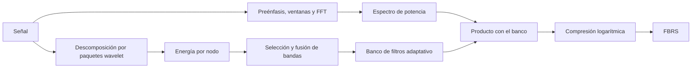

# FBRS: fundamentos, adaptación y verificación

## Propósito

Este documento explica FBRS (*Frequency-Band Recalibrated Spectrogram*) y registra cómo se
adapta al conjunto de datos del proyecto. `docs/paper-summary.md` resume el método original y
`docs/methodology.md` es la fuente de verdad del protocolo experimental.

## Idea central

Un espectrograma puede verse como un espectro de potencia multiplicado por un banco de filtros:

```python
spectrogram = log(power_spectrum @ filterbank.T + epsilon)
```

STFT, Mel, CQT y FBRS difieren principalmente en la construcción de `filterbank`:

| Representación | Distribución de bandas | Adaptativa |
|---|---|---|
| STFT | Uniforme, una banda por bin de FFT | No |
| Mel | Fija sobre la escala Mel | No |
| CQT | Geométrica, con `Q` aproximadamente constante | No |
| FBRS | Partición diádica guiada por energía | Sí |

FBRS utiliza un árbol de paquetes wavelet como espacio de posibles particiones. Conserva mayor
resolución en regiones de alta energía y fusiona regiones de menor energía. El árbol no es el
resultado final: es el conjunto de particiones entre las que el algoritmo elige.

## Descomposición por paquetes wavelet

### Una división

Cada nodo produce dos señales mediante un par complementario de filtros pasa bajos y pasa altos,
seguido de submuestreo por dos:

```python
def split(x, lowpass_filter, highpass_filter):
    low = downsample2(convolve(x, lowpass_filter))
    high = downsample2(convolve(x, highpass_filter))
    return low, high
```

Si un nodo cubre `[f_a, f_b]`, sus hijos cubren las dos mitades de ese intervalo. Una
descomposición de nivel `L` produce `2**L` hojas de igual ancho.

### Diferencia entre DWT y WPD

La DWT continúa descomponiendo únicamente la rama pasa bajos. La WPD (*Wavelet Packet
Decomposition*) descompone ambas ramas y genera un árbol binario completo. Esto permite formar
particiones no uniformes al reconstruir algunos padres y conservar otros hijos.

### Conservación y reconstrucción

Con una wavelet ortogonal y salvo efectos de borde:

- la energía de un padre coincide con la suma de la energía de sus hijos;
- un padre puede reconstruirse a partir de sus dos hijos.

Estas propiedades permiten comparar energías y fusionar bandas sin dejar huecos en el intervalo
de frecuencias.

### Orden frecuencial

El orden natural de los nodos de una WPD no coincide necesariamente con su orden en frecuencia,
porque las ramas pasa altos invierten el espectro. En PyWavelets debe solicitarse explícitamente
el orden frecuencial:

```python
nodes = wavelet_packet.get_level(level, order="freq")
```

Usar el orden natural puede producir un banco con bandas permutadas que aún genere imágenes
plausibles y permita entrenar, por lo que se trata de un error silencioso. La implementación
debe comprobarlo con tonos puros.

## Algoritmo FBRS

El método contiene dos rutas que se encuentran al final:



La ruta espectral utiliza la etapa inicial convencional para obtener `P(k)`. La ruta wavelet
determina la partición frecuencial y el banco `H_j(k)`. La salida es

$$
ER(j) = \sum_k P(k)H_j(k),
$$

$$
\operatorname{FBRS}(j) = \log(ER(j) + \varepsilon).
$$

### Energía de los nodos

La energía de un nodo se calcula como la suma de cuadrados de sus coeficientes:

$$
E_n = \sum_i c_n(i)^2.
$$

Puede normalizarse dentro del nivel:

$$
\widetilde E_n = \frac{E_n}{\sum_{m \in \text{nivel}} E_m}.
$$

La normalización elimina la dependencia con la amplitud absoluta y permite agregar estadísticas
entre ejemplos.

### Restricción simbiótica

Una partición válida contiene un nodo padre o sus dos hijos, pero no una combinación incompleta.
Por eso la decisión de conservar resolución o fusionar se toma sobre pares de hermanos.

El algoritmo debe mantener este invariante:

> Las bandas finales no se solapan, no dejan huecos y cubren exactamente el intervalo entre
> `0` y Nyquist.

Este invariante es también una de las pruebas principales de la implementación.

### Ancho de las hojas

Con la convención estándar, una WPD real sobre audio muestreado a `f_s` divide el intervalo
`[0, f_s/2]`. Por tanto, el ancho de una hoja de nivel `L` es

$$
\Delta f_{\min} = \frac{f_s/2}{2^L} = \frac{f_s}{2^{L+1}}.
$$

El artículo escribe `f_s / 2^L`, que difiere por un factor de dos bajo esta convención. En este
proyecto se utiliza el intervalo de Nyquist explícito para evitar la ambigüedad.

## Aspectos ambiguos del artículo

La publicación no especifica suficientemente varios detalles necesarios para reproducir FBRS:

- el valor del umbral energético `Er`;
- si se selecciona un solo par vorazmente o todos los pares que superan un umbral;
- si el banco se ajusta por clip o una sola vez sobre el corpus;
- la forma exacta de cada filtro;
- la longitud de ventana, el salto y el tamaño de FFT;
- cómo convertir un número variable de bandas en la entrada fija de la red.

Estas omisiones impiden considerar el pseudocódigo del artículo como una especificación ejecutable.
La adaptación del proyecto debe declarar cada decisión en configuración y validarla mediante
ablaciones cuando sea relevante.

## Adaptación a AnuraSet

### Datos relevantes

| Propiedad | Valor |
|---|---:|
| Frecuencia de muestreo | 22,050 Hz |
| Nyquist | 11,025 Hz |
| Duración del clip | 3 s |
| Etiquetas entrenables | 40 |
| Tarea | Clasificación multietiqueta |

El patrón energético de las aves reportado en el artículo no se transfiere automáticamente a
anuros. La distribución frecuencial debe estimarse con los datos de entrenamiento del proyecto.

### Decisiones vigentes

`configs/dlognet_fbrs.yaml` declara actualmente:

| Decisión | Valor |
|---|---|
| Wavelet | `db16` |
| Nivel | `8` |
| Alcance del banco | Un banco para el corpus |
| Subconjunto de ajuste | Ejemplos positivos de entrenamiento |
| Normalización de energía | Por nivel |
| Regla de selección | Número objetivo de bandas |
| Número objetivo | 128 bandas |
| Forma de filtro | Triangular |
| FFT | 1024 muestras |
| Salto | 256 muestras |
| Centrado | Desactivado |
| Preénfasis | 0.97 |
| Ventana | Hamming |

Con `f_s = 22,050` y `L = 8`, el ancho mínimo estándar es

$$
\Delta f_{\min} = \frac{11,025}{256} \approx 43.07\ \text{Hz}.
$$

Un banco de 128 bandas tiene una anchura media aproximada de 86.13 Hz, aunque sus bandas reales
son diádicas y no uniformes.

### Banco global en lugar de banco por clip

El pseudocódigo del artículo recibe una señal individual y sugiere un banco por clip. Esa opción
presenta dos problemas:

1. el número de bandas puede variar entre ejemplos;
2. una misma fila del espectrograma puede representar intervalos distintos en cada clip.

Redimensionar las imágenes resuelve solo el primer problema y puede ocultar el segundo. Para que
la geometría frecuencial sea comparable entre ejemplos, este proyecto ajusta un banco único con
estadísticas agregadas de entrenamiento y después lo congela para validación y prueba.

No debe utilizarse información de validación o prueba para ajustar el banco.

### Uso de ejemplos positivos

El banco se ajusta inicialmente con `positive_training`, es decir, con clips de entrenamiento
que contienen al menos una etiqueta positiva. Los clips totalmente negativos se conservan para
entrenar el clasificador, pero no determinan la partición inicial del banco.

Esta decisión evita que la gran proporción de filas sin etiquetas positivas domine el criterio
energético. No implica que esos clips sean fondo puro. Su efecto debe comprobarse frente a una
ablación que ajuste el banco con todo entrenamiento.

### Número objetivo de bandas

El artículo no proporciona `Er`, por lo que la configuración usa `target_count` para producir un
número fijo y reproducible de bandas. El algoritmo debe fusionar pares válidos hasta alcanzar
128 bandas o el estado válido más cercano si la estructura diádica impide obtener exactamente
ese número.

La política de desempate y la respuesta cuando no pueda alcanzarse exactamente el objetivo deben
quedar definidas en código y cubiertas por pruebas.

### Forma triangular

Cada banda final se convierte en una fila triangular del banco de filtros sobre los bins de la
FFT. Las bandas adyacentes deben compartir sus bordes de manera consistente y cada fila debe
normalizarse según una regla explícita.

Un nivel demasiado alto respecto de `n_fft` puede generar bandas más estrechas que la separación
entre bins. La implementación debe impedir filtros vacíos o advertir cuando varias bandas se
proyecten sobre los mismos bins.

## Esquema de implementación

La lógica definitiva debe residir en `src/anuraset_dl/`. Una separación útil es:

1. extracción de energías wavelet sobre entrenamiento;
2. agregación de energía por nodo;
3. construcción de una partición válida con el número objetivo de bandas;
4. proyección de las bandas a una matriz de filtros;
5. transformación de cada clip mediante el banco congelado;
6. persistencia del banco y de sus metadatos en `outputs/`.

Cada artefacto del banco debería registrar al menos:

- frecuencia de muestreo;
- wavelet y nivel;
- subconjunto y partición usados para el ajuste;
- estadística de agregación;
- intervalos frecuenciales finales;
- forma y normalización de filtros;
- `n_fft`, salto, ventana y preénfasis;
- versión de la configuración o huella de sus parámetros.

## Verificación requerida

| Prueba | Invariante esperado |
|---|---|
| Conservación de energía | La suma de energías de los hijos aproxima la del padre. |
| Cobertura | Las bandas finales cubren `[0, f_s/2]` sin huecos ni solapamientos. |
| Restricción de hermanos | Ninguna fusión deja un único hijo activo. |
| Orden frecuencial | Los límites de banda son estrictamente crecientes. |
| Tono puro | Un seno concentra su energía en la banda que contiene su frecuencia. |
| Reproducibilidad | Los mismos datos, configuración y semilla producen el mismo banco. |
| Ausencia de fugas | El ajuste solo lee la partición de entrenamiento. |
| Forma | Todos los clips producen tensores con dimensiones idénticas. |
| Estabilidad numérica | La salida no contiene `NaN` ni infinitos, incluso con silencio. |
| Serialización | Guardar y cargar el banco no cambia sus respuestas. |

La prueba de tonos puros debe barrer varias frecuencias, por ejemplo 500, 1000, 2000, 4000 y
8000 Hz. Es la comprobación más directa contra errores en el orden de nodos.

## Ablaciones pendientes

Antes de fijar FBRS para el experimento final conviene comparar, usando solo entrenamiento para
ajustar cada variante:

- FBRS frente a Mel con el mismo clasificador;
- banco ajustado con ejemplos positivos frente a todo entrenamiento;
- distintos niveles `L` compatibles con la resolución de FFT;
- distintos números objetivo de bandas;
- forma triangular frente a una alternativa rectangular, si se implementa;
- DLoGNet con FBRS frente a una CNN con FBRS para separar el efecto de la arquitectura.

Los resultados y artefactos deben registrarse en `docs/experiments.md`.

## Resumen

FBRS usa una WPD para proponer una partición diádica del intervalo de Nyquist y utiliza energía
de entrenamiento para decidir dónde conservar mayor resolución. Esa partición se transforma en
un banco de filtros que opera sobre espectros de potencia y produce una representación
logarítmica.

Para AnuraSet se adopta un banco global, reproducible y ajustado solo con ejemplos positivos de
entrenamiento. Las decisiones actuales —`db16`, `L = 8`, 128 bandas y filtros triangulares— son
puntos de partida configurables, no resultados ya validados.
