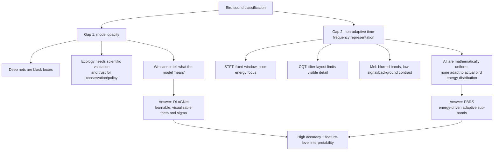
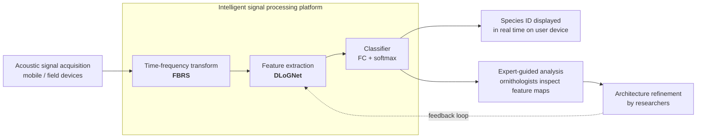
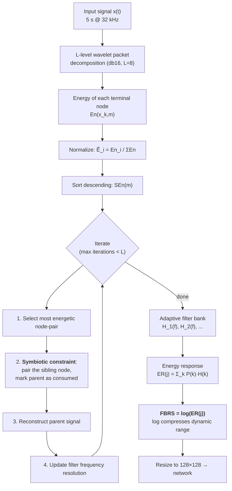
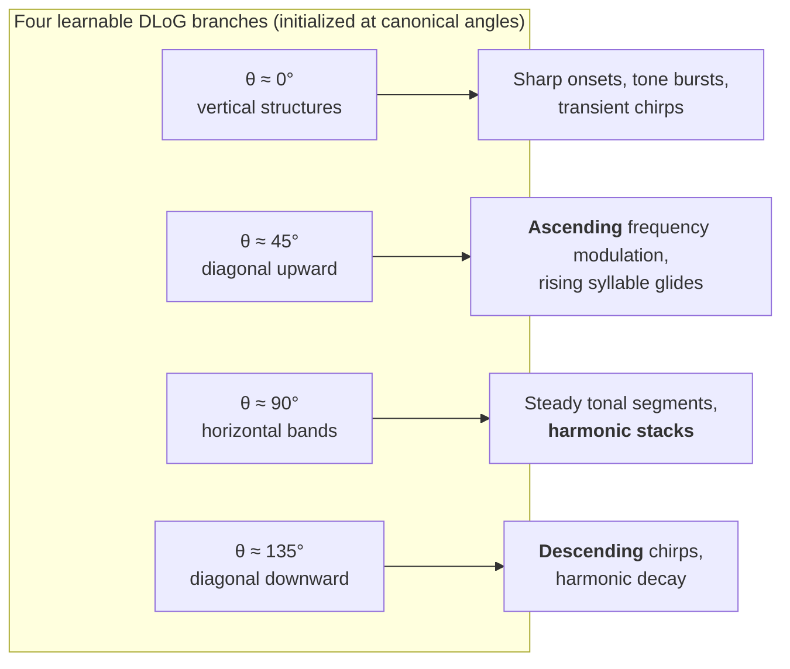
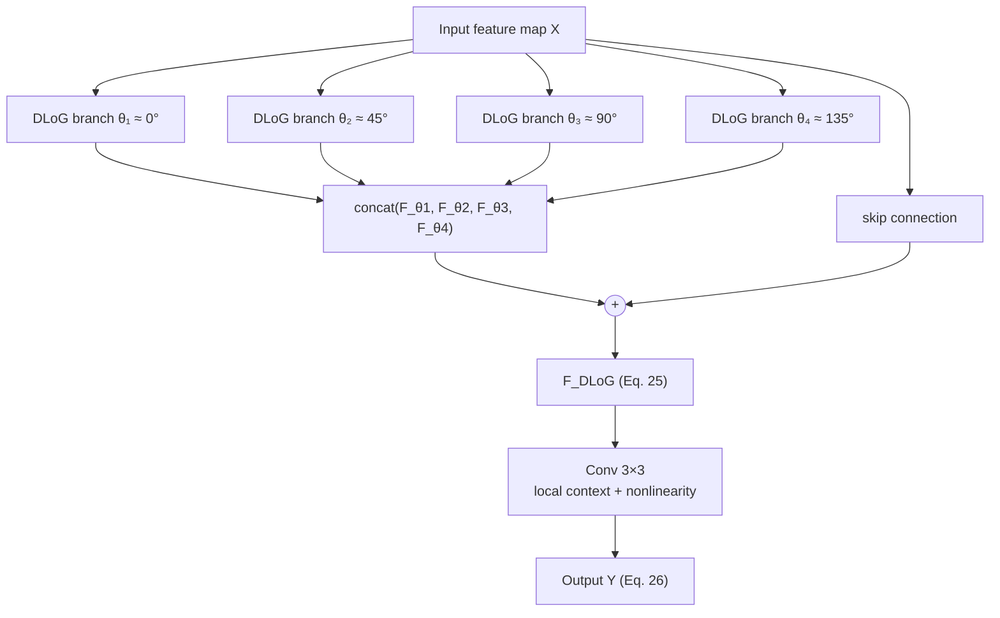
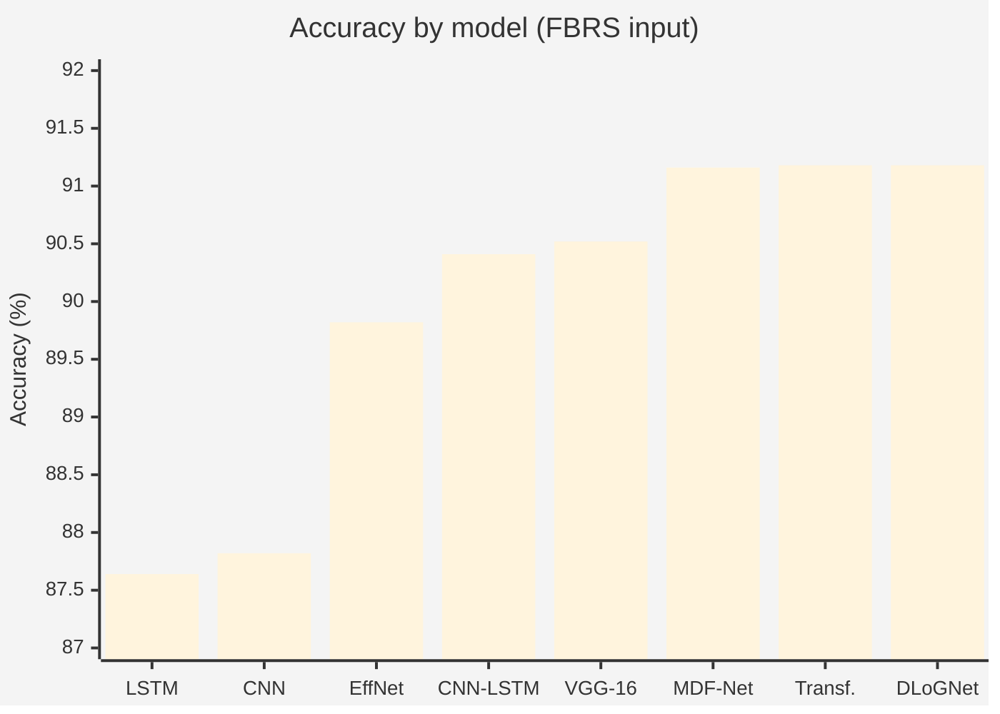
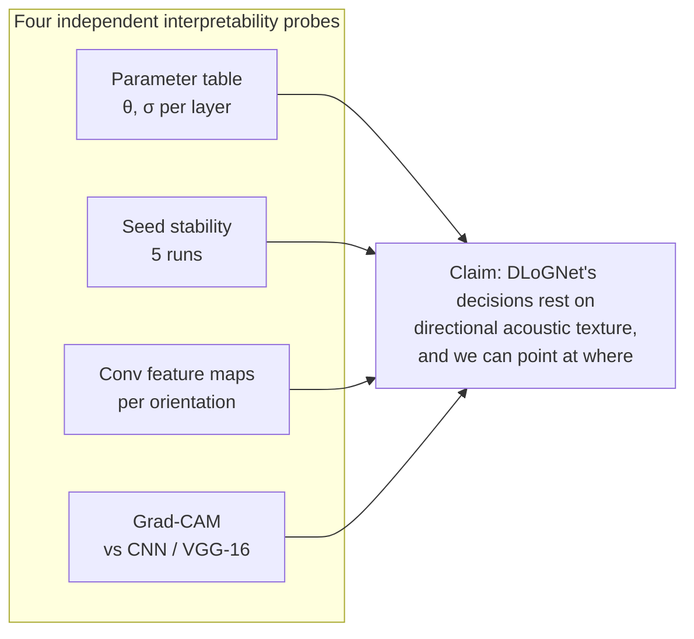
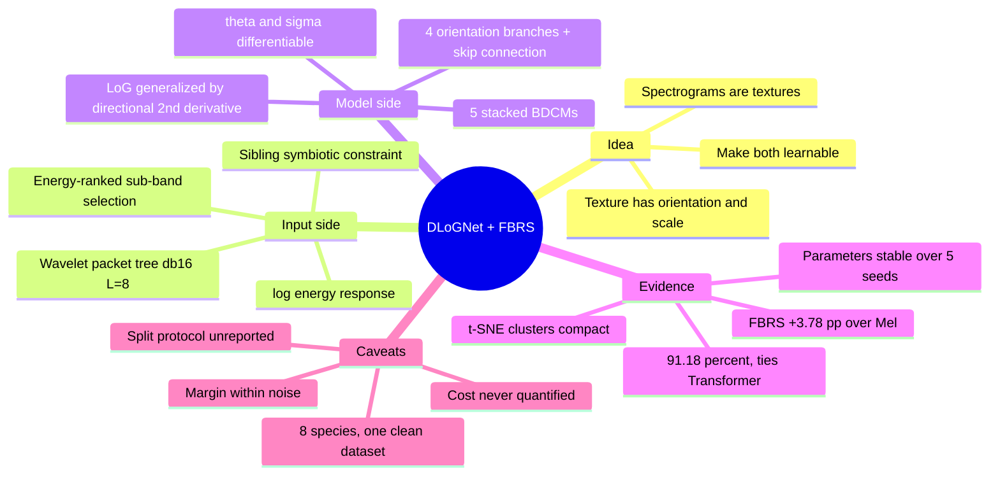

# Towards Accurate Bird Sound Recognition Through Multi-Scale Texture-Aware Modeling

> **Authors:** Rui Qin & Jing Huang — Institute for Infrastructure and Environment, School of Engineering, University of Edinburgh
> **Venue:** *npj Acoustics* (2025) 1:22 · DOI [10.1038/s44384-025-00025-6](https://doi.org/10.1038/s44384-025-00025-6)
> **Received:** 10 May 2025 · **Accepted:** 23 Aug 2025 · License CC BY-NC-ND 4.0

---

## 1. TL;DR

The paper attacks bird-species classification from audio with **two coupled contributions**, one on the *input side* and one on the *model side*:

| | Contribution | What it does | Why it matters |
|---|---|---|---|
| **Input** | **FBRS** — Frequency-Band Recalibrated Spectrogram | Wavelet-packet decomposition + **energy-guided sub-band selection** builds an *adaptive* filter bank instead of a fixed one (STFT/CQT/Mel) | Concentrates resolution where bird energy actually lives (1–8 kHz), suppresses noise, and every filter traces back to a physical wavelet-packet node |
| **Model** | **DLoGNet** — Directional Laplacian-of-Gaussian Network | Replaces generic conv kernels with **LoG kernels having learnable orientation θ and scale σ** | Filters become "acoustic edge detectors" you can read: ascending chirps, descending glides, horizontal harmonics — i.e. built-in interpretability (XAI), not post-hoc |

**Headline result:** 91.18% accuracy on 8 bird species, vs 87.82% (CNN), 87.64% (LSTM), 90.41% (CNN-LSTM), 89.82% (EfficientNet), 90.52% (VGG-16), **91.18% (Transformer)**, 91.16% (MDF-Net).

**Honest reading:** the accuracy gain over strong baselines is *marginal* (it ties the Transformer exactly). The paper's real selling point is **interpretability at equal accuracy**, not raw performance. See §9.

---

## 2. The problem being solved

Two gaps are argued in the introduction:



Bird vocalizations are **non-stationary**: rapid frequency modulation, harmonic stacks, temporal discontinuities, and huge variation across individuals, geography and behavioral context. Handcrafted features (MFCC, spectral centroid, pitch contours) + shallow classifiers (SVM, RF, k-NN) cannot capture that hierarchy; deep models can, but say nothing about *why*.

---

## 3. End-to-end system framework



The framework is explicitly designed as a **human-in-the-loop**: intermediate feature maps are meant to be inspected by domain experts, whose insight feeds back into model design.

---

## 4. Contribution 1 — FBRS (the adaptive spectrogram)

### 4.1 Intuition

A standard spectrogram spends the same resolution on every frequency band. Bird calls put almost all energy in **0–8 kHz with a peak at 3–5 kHz** (negligible above 10 kHz). FBRS therefore **spends resolution proportionally to measured energy**: decompose into a fine wavelet-packet tree, rank sub-bands by energy, and greedily merge/reconstruct the highest-energy ones into an adaptive filter bank.

### 4.2 Algorithm



**Key equations**

| Eq. | Meaning |
|---|---|
| (5)–(6) | Wavelet-packet series decomposition; `w₀ = φ(t)` scaling function, `w₁ = ψ(t)` wavelet function |
| (7) | Node energy `En(x(t)) = Σ En(x_{k,m}(i))` |
| (8) | Normalized energy `Ẽ_i = Enᵢ / Σ En` — enables fair cross-band comparison |
| (9) | Descending sort of normalized energies |
| (10) | Minimum frequency resolution `Δf_min = f_s / 2^L` |
| (11) | Filter-bank energy response `ER(j) = Σ_k P(k)H(k)`, `P(k)` = power spectrum |
| (12) | **`FBRS = log(ER(j))`** |

**The "symbiotic constraint"** is the clever engineering detail: in a wavelet-packet tree, sibling nodes must be selected *together* so the parent can be perfectly reconstructed. Selecting a node alone would break invertibility, so energy selection operates on **node pairs**.

### 4.3 Why FBRS beats fixed representations

1. Low-energy / irrelevant bands are discarded or down-weighted.
2. Band partition follows the **actual signal energy structure**, not a fixed grid.
3. **Traceability:** every filter maps back to a specific wavelet-packet node → the spectrogram is physically interpretable.

Reported qualitative gains over STFT/CQT/Mel: stronger noise suppression, higher SNR, sharper 1–8 kHz vocal elements, better time/frequency balance.

### 4.4 Choosing the decomposition level L

| Level L | 6 | 7 | 8 | 9 |
|---|---|---|---|---|
| Accuracy (%) | 91.12 | 91.12 | **91.18** | 91.18 |

Accuracy **saturates at L = 8**; L = 9 adds cost with no gain. → **L = 8, db16 wavelet** used throughout. (Note the spread across all L is only 0.06% — this hyperparameter barely matters.)

---

## 5. Contribution 2 — DLoG kernels (the interpretable filter)

### 5.1 From LoG to Directional LoG

The classical **Laplacian of Gaussian** is an isotropic blob/edge detector:

```
G(x,y,σ)   = (1/2πσ²)·exp(−(x²+y²)/2σ²)                       (14)
LoG(x,y,σ) = ∇²G = [(x²+y²−2σ²)/σ⁴]·exp(−(x²+y²)/2σ²)         (13),(15)
```

Its weakness: **it responds equally to all directions**, so it cannot tell an ascending chirp from a descending glide. The authors add a directional second derivative along `n = (cos θ, sin θ)`:

```
DLoG(x,y,σ,θ) = ∂²G/∂n² = nᵀ H_G n                             (17),(18)
              = cos²θ·G_xx + sin²θ·G_yy + 2 sinθ cosθ·G_xy      (19)
```

where `H_G` is the Hessian of the Gaussian.

### 5.2 What makes it learnable (the crux of the paper)

Both **θ (orientation)** and **σ (scale)** are exposed as trainable parameters with closed-form, fully differentiable gradients:

```
∂DLoG/∂σ = cos²θ·∂G_xx/∂σ + sin²θ·∂G_yy/∂σ + 2 sinθ cosθ·∂G_xy/∂σ   (22)
∂DLoG/∂θ = −2 sinθ cosθ·G_xx + 2 sinθ cosθ·G_yy
           + 2(cos²θ − sin²θ)·G_xy                                    (23)
```

Updated by ordinary SGD/chain rule: `σ ← σ − lr·δσ`, `θ ← θ − lr·δθ` (Eqs. 20–21).

This is the interpretability mechanism: **the network's learned parameters are physically meaningful angles and scales**, not opaque weight tensors. You can print them in a table (§8.1) and read them.

### 5.3 Acoustic meaning of each orientation



The authors explicitly frame this as mirroring **orientation-selective neurons in early visual cortex** — a biologically inspired prior over spectrogram texture.

---

## 6. Architecture — BDCM and DLoGNet

### 6.1 Basic DLoG Convolution Module (BDCM)



```
F_DLoG = concat(F_θ1,σ , F_θ2,σ , F_θ3,σ , F_θ4,σ) + X          (25)
Y      = Conv3×3(F_DLoG)                                        (26)
```

The **residual concatenation** exists to stop directional filtering (which is a high-pass, second-derivative operation) from destroying fundamental **low-frequency** acoustic content.

### 6.2 Full network

```
Yᵢ = MaxPool( ReLU( DLoGConv(Y_{i−1}, θᵢ, σᵢ) + bᵢ ) ),  i = 1..5   (27)
z  = FC( GlobalPooling(Y₅) )                                        (28)
ŷ  = softmax(z)                                                     (29)
ψ  = −Σ_c y_c log(ŷ_c)      ← cross-entropy loss                    (30)
```

| Stage | Layer | Output shape |
|---|---|---|
| **BDCM-1** | DLoG-1 → Conv 3×3 → BN + ReLU + MaxPool | `[4,128,128]` → `[64,128,128]` → `[64,64,64]` |
| **BDCM-2** | DLoG-2 → Conv 3×3 → BN + ReLU + MaxPool | `[256,64,64]` → `[128,64,64]` → `[128,32,32]` |
| **BDCM-3** | DLoG-3 → Conv 3×3 → BN + ReLU + MaxPool | `[512,32,32]` → `[128,32,32]` → `[128,16,16]` |
| **BDCM-4** | DLoG-4 → Conv 3×3 → BN + ReLU + MaxPool | `[512,16,16]` → `[128,16,16]` → `[128,8,8]` |
| **BDCM-5** | DLoG-5 → Conv 3×3 → BN + ReLU + MaxPool | `[512,8,8]` → `[64,8,8]` → `[64,4,4]` |
| Head | FC-1 → FC-2 | `[1024]` → `[8]` |

Two design principles the authors state: **(1)** progressive directional feature extraction through a deep stack of learnable DLoG filters; **(2)** end-to-end joint learning of (θ, σ) *alongside* the classifier weights.

---

## 7. Experimental setup

### 7.1 Data

- **Source:** Kaggle `ayush5556/bird-sound-dataset` — 22 species, 32 kHz, variable length.
- **Subset used:** **8 species**, chosen for vocalization clarity and sufficient representation.
- **Segmentation:** every recording split into fixed **5-second clips** (this *is* the augmentation; other augmentation is explicitly out of scope).
- **Balancing:** species with abundant audio capped at **3000 random clips**; scarcer species keep everything.

| Species (code) | Samples | Species (code) | Samples |
|---|---|---|---|
| Barn Swallow (`barswa`) | 3000 | Black Crowned Night Heron (`bcnher`) | 3000 |
| Black Winged Stilt (`bkwsti`) | 3000 | Blyth's Reed Warbler (`blrwar1`) | 3000 |
| Common Greenshank (`comgre`) | 2665 | Common Kingfisher (`comkin1`) | 2900 |
| Common Moorhen (`commoo3`) | 2171 | Common Rosefinch (`comros`) | 3000 |

*Total ≈ 22,736 clips; mild imbalance (2171–3000).*

### 7.2 Training configuration

| Setting | Value |
|---|---|
| Framework / HW | PyTorch, Python 3.12, single **NVIDIA RTX 4060 (8 GB)** |
| Input | FBRS resized to **128 × 128**, from 5 s @ 32 kHz |
| Architecture | 5 stacked DLoG modules × 4 orientation kernels each → GAP → FC |
| Activation / Norm | ReLU, BatchNorm after every conv block |
| Loss / Optimizer | Cross-entropy, **Adam** |
| LR schedule | init **1e-4**, ×0.9 decay every 10 epochs |
| Epochs / Batch | 50 / 32, **early stopping** on validation accuracy |
| Fairness | *All* baselines use the same input, hyperparameters and protocol |

### 7.3 Metrics (Eqs. 1–4)

`AR = (TP+TN)/(TP+TN+FP+FN)` · `PR = TP/(TP+FP)` · `RR = TP/(TP+FN)` · `F1S = 2TP/(2TP+FP+FN)` — precision/recall macro-averaged over the 8 classes.

---

## 8. Results

### 8.1 Ablation — does FBRS actually help? (Table 3)

| Input → | MFS (Mel) | **FBRS** | Δ |
|---|---|---|---|
| **CNN (5-layer)** | 85.09% | 87.82% | **+2.73** |
| **DLoGNet** | 87.40% | **91.18%** | **+3.78** |
| Δ (model) | +2.31 | +3.36 | |

Two clean readings:
- FBRS helps **both** architectures → the representation contributes independently.
- The gain is **larger for DLoGNet (+3.78 vs +2.73)** → the two contributions are **synergistic**: directional/multi-scale filters can only exploit structure that the representation actually preserves. The authors state plainly that *DLoGNet under MFS input is still worse than SOTA baselines* — **the benefit is only realized when paired with FBRS.**

### 8.2 Model comparison (Table 4, all on FBRS input)

| Model | AR (%) | PR (%) | RR (%) | F1-S (%) |
|---|---|---|---|---|
| **DLoGNet (proposed)** | **91.18** | **91.09** | 91.23 | **91.16** |
| Transformer | **91.18** | 91.05 | **91.26** | **91.16** |
| MDF-Net | 91.16 | 91.09 | 91.13 | 91.11 |
| VGG-16 | 90.52 | 90.43 | 90.50 | 90.47 |
| CNN-LSTM | 90.41 | 90.30 | 90.36 | 90.33 |
| EfficientNet | 89.82 | 89.69 | 89.80 | 89.75 |
| CNN | 87.82 | 87.75 | 87.82 | 87.79 |
| LSTM | 87.64 | 87.55 | 87.64 | 87.60 |



**Interpretation:** CNN-only and LSTM-only sit at the bottom — modeling *either* spatial *or* temporal structure in isolation is insufficient. Everything that models both (hybrid, deep CNN, self-attention, directional conv) lands in a tight **90.4–91.2%** band. DLoGNet reaches the top of that band **with a smaller, purpose-built, interpretable architecture**.

### 8.3 Confusion matrices (Fig. 6)

- **DLoGNet** shows the strongest diagonal dominance; notably it separates the acoustically similar **class 3 vs class 7** and reduces the **class 5 / class 6** confusion (overlapping frequency patterns) that other models suffer.
- **CNN / LSTM** scatter errors across the acoustically dense **classes 4–6**.
- **CNN-LSTM** improves on both components but stays behind.
- **EfficientNet / VGG-16** are accurate but confuse subtle vocal differences — depth or parameter efficiency alone doesn't capture *directionality*.
- **Transformer / MDF-Net** look nearly as clean as DLoGNet.

### 8.4 t-SNE embedding quality (Fig. 4)

| Config | Cluster behavior |
|---|---|
| CNN + MFS | most entangled |
| DLoGNet + MFS | better, still diffuse |
| CNN + FBRS | classes **0, 1, 4 heavily entangled**, irregular dispersion |
| **DLoGNet + FBRS** | compact, clearly delimited clusters (**2, 3, 6**); previously fused **0 vs 4 separate** |

The 2×2 design isolates the two factors: FBRS improves clustering for *both* models (input effect), and DLoGNet improves it further at fixed input (architecture effect).

---

## 9. Interpretability evidence (the paper's real payload)

### 9.1 Learned parameters are readable (Table 5)

| Layer | θ₁ | θ₂ | θ₃ | θ₄ | σ |
|---|---|---|---|---|---|
| DLoG-1 | 0.0103 | 0.8087 | 1.5711 | 2.3420 | 1.2955 |
| DLoG-2 | −0.0048 | 0.7795 | 1.5627 | 2.3651 | 1.3549 |
| DLoG-3 | −0.0067 | 0.7709 | 1.5597 | 2.3627 | 1.3743 |
| DLoG-4 | −0.0294 | 0.7755 | 1.5782 | 2.3692 | **1.4161** |
| DLoG-5 | −0.0069 | 0.6901 | 1.5937 | 2.4356 | 1.3762 |

*(canonical references: 0, π/4 ≈ 0.785, π/2 ≈ 1.571, 3π/4 ≈ 2.356)*

Three readable findings:
1. **θ stays near the canonical orientations** but drifts slightly — the network *fine-tunes* directions toward the dominant spectrogram structures rather than abandoning them.
2. **σ increases monotonically DLoG-1 → DLoG-4** (1.2955 → 1.4161): deeper layers learn **broader receptive fields**, consistent with hierarchical abstraction. **DLoG-5 dips slightly** (1.3762) — read as a refinement stage re-focusing on mid-scale frequency modulation.
3. Deeper-layer **θ₁ deviates from 0** (−0.0294 at DLoG-4) — even the "vertical" filter picks up nuanced diagonal trends.

### 9.2 Reproducibility of the interpretation (Fig. 7)

Training was repeated **5× with different random seeds**. The final-layer θ₁–θ₄ spread and σ **remain stable across runs** — so the interpretability claim isn't an artifact of one lucky initialization. *(This is the right experiment to run for a "learnable-parameter-as-explanation" claim, and it is the paper's strongest methodological move.)*

### 9.3 Feature maps and Grad-CAM (Figs. 8, 9)

- **Fig. 8** — the four first-layer DLoG responses activate on visibly different structures (vertical transients / ascending / horizontal harmonics / descending), confirming the branches don't collapse onto redundant filters.
- **Fig. 9** — Grad-CAM: **DLoGNet attends to coherent spectral structures** (chirps, harmonics), while **CNN and VGG-16 attention is dispersed and less interpretable**.



---

## 10. Limitations (author-stated + critical reading)

**Stated by the authors**

| # | Limitation | Proposed future work |
|---|---|---|
| 1 | Learnable θ/σ add **computational overhead** vs standard CNNs | Parameter sharing, efficient kernel approximation |
| 2 | Pipeline **depends on time-frequency input**; raw waveform dynamics may be lost | End-to-end raw-audio, or hybrid waveform + TF features |
| 3 | Interpretability shown only via **visualization, not expert validation** | Collaborate with **ornithologists** to confirm the highlighted patterns are biologically meaningful |

**Additional points worth flagging when you read/cite this**

- **The margin is thin.** DLoGNet ties the Transformer to 4 significant figures (91.18 / 91.16 F1) and beats MDF-Net by 0.02 pp. No confidence intervals, error bars, or significance tests are reported for Table 4 — despite the fact that the 5-seed protocol needed to produce them clearly exists (it was used in Fig. 7). The claim to defend is **"equal accuracy, far more interpretable"**, not "more accurate".
- **No cost measurement.** Overhead is acknowledged qualitatively but never quantified — no parameter counts, FLOPs, or inference latency, which matters for the stated field-deployment use case.
- **Narrow evaluation.** 8 of 22 species, one dataset, clips selected for *clarity* of vocalization; no cross-dataset or noisy-soundscape generalization test, no multi-label / overlapping-caller scenario. Real soundscapes are the harder problem the intro motivates.
- **No train/val/test split reported.** Early stopping uses a validation set, but the split ratio and — critically — whether 5-s clips from the *same recording* can land in both train and test are never stated. If they can, accuracy is optimistically biased by clip leakage.
- **Data & code availability.** The data-availability statement says no datasets were generated or analyzed, which conflicts with the Kaggle source given in §Results. Code is "available on reasonable request" — not public.
- **L is nearly irrelevant.** The L = 6→9 sweep spans 0.06%; presenting L = 8 as a tuned choice slightly overstates the sensitivity.

---

## 11. What to take away



**The transferable lesson** is architectural, not ornithological: instead of interpreting a black box *after* training (Grad-CAM, saliency), **parameterize the filters by physically meaningful quantities (angle, scale) and let gradient descent tune those**. Interpretation then becomes reading a table of numbers, and it is testable for stability across seeds. The same trick applies to any domain where the input has directional texture — sonar, seismic traces, vibration/fault diagnosis, radar, medical ultrasound.

**The pairing lesson** matters just as much: FBRS gives +2.73 pp to a plain CNN but +3.78 pp to DLoGNet, and DLoGNet on Mel input underperforms the SOTA baselines. **Representation and architecture were co-designed, and neither carries the result alone.**

---

### Key references from the paper

- Gunn, S. R. *On the discrete representation of the Laplacian of Gaussian.* Pattern Recognit. **32**, 1463–1472 (1999) — the LoG basis (ref. 36).
- Xie, S. et al. *MDF-Net: a multi-view dual-attention fusion network for efficient bird sound classification.* Appl. Acoust. **225**, 110138 (2024) — strongest specialized baseline (ref. 35).
- Zhang, S. et al. *A novel bird sound recognition method based on multifeature fusion and a transformer encoder.* Sensors **23**, 8099 (2023) — the Transformer baseline (ref. 34).
- Heinrich, R. et al. *AudioProtoPNet: an interpretable deep learning model for bird sound classification.* Ecol. Inform. **87**, 103081 (2025) — the competing interpretability approach (ref. 20).
- Hsu, S.-B. et al. *Local wavelet acoustic pattern.* IEEE Trans. Multimed. **20**, 3187–3199 (2018) — wavelet lineage for FBRS (ref. 25).
